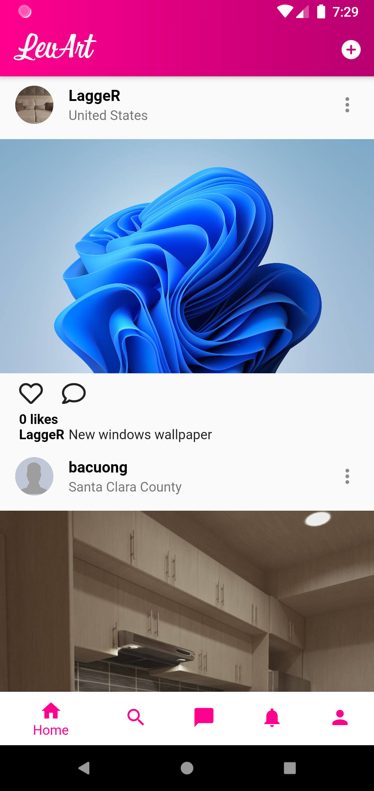
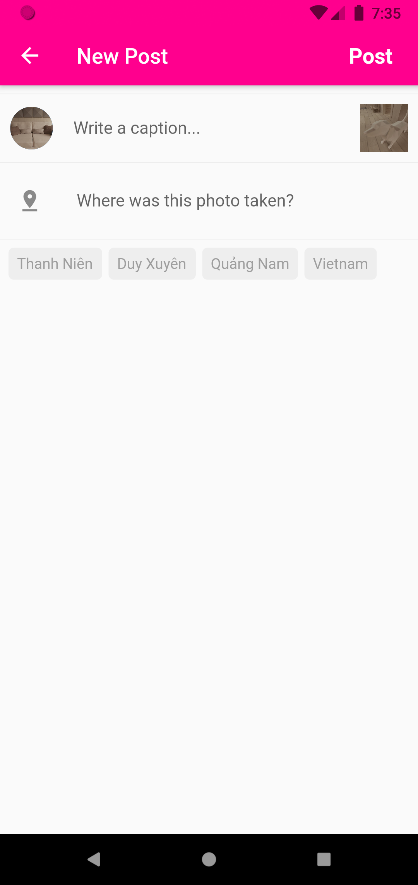
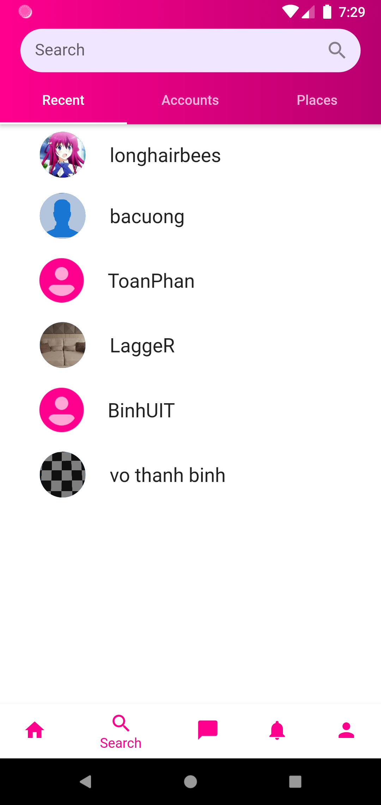
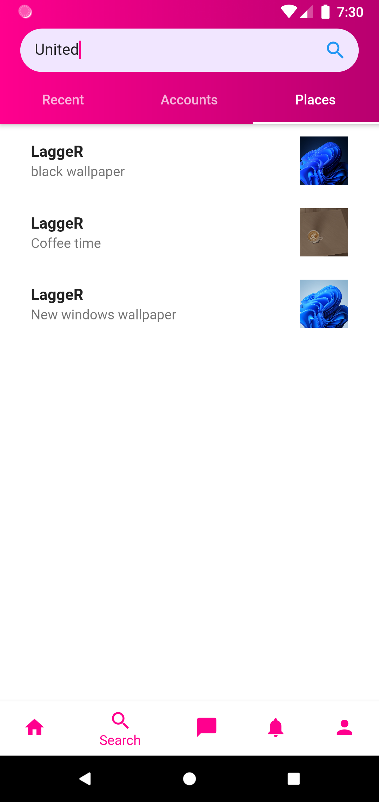
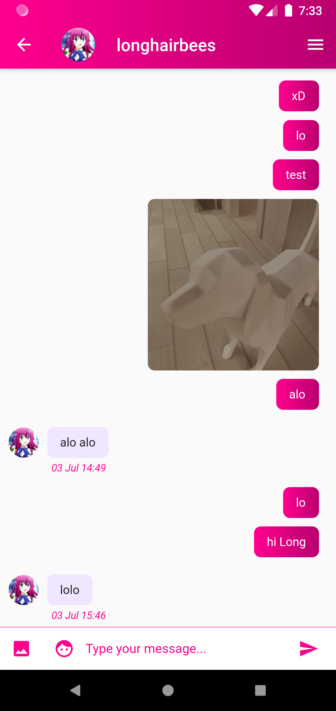
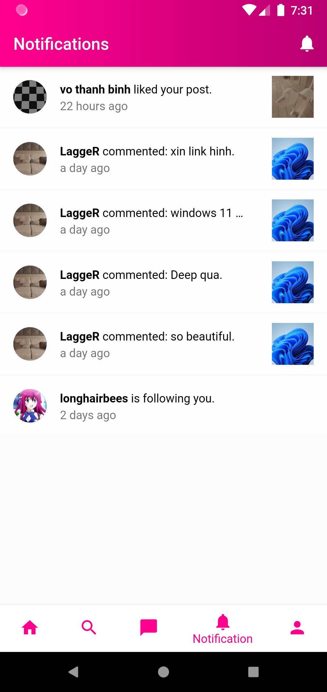
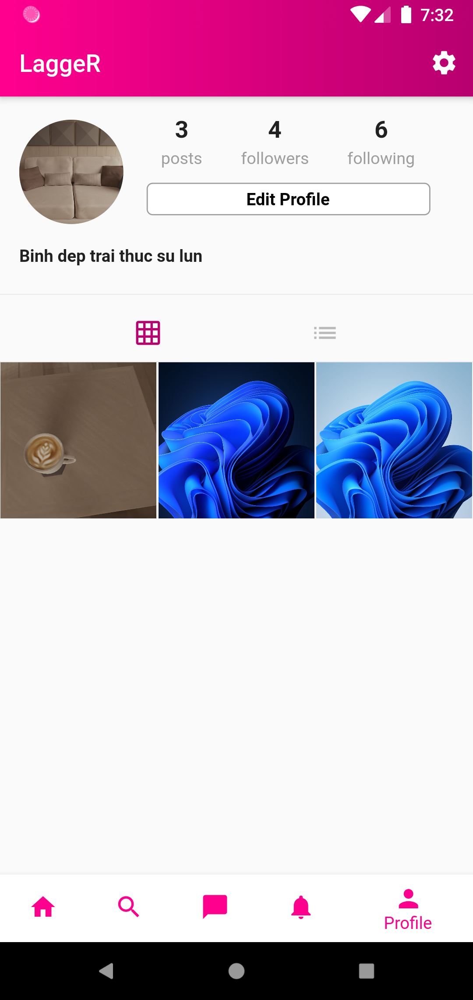
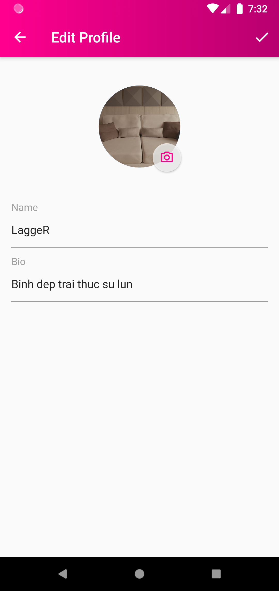

# LevArt

Ứng dụng mạng xã hội về du lịch


## Yêu cầu thiết bị

Android

`Gradle : 6.7`

`minSdkVersion: 23`

`targetSdkVersion: 30`

  
## Công nghệ sử dụng

**Flutter - Firebase**

  
## Thư viện

Dart packages: https://pub.dev/

- path_provider: ^2.0.2
- path: ^1.8.0
- firebase_core: ^1.0.1
- cloud_firestore: ^1.0.1
- image_picker: ^0.7.2+1
- firebase_storage: ^8.0.0
- firebase_auth: ^1.0.1
- geolocator: ^7.1.0
- geocoder: ^0.2.1
- location: ^4.2.2
- font_awesome_flutter: ^9.1.0
- cached_network_image: ^3.0.0
- flare_flutter: ^3.0.1
- firebase_messaging: ^10.0.0
- photo_view: ^0.10.2
- firebase_analytics: ^5.0.2
- firebase_in_app_messaging: ^0.5.0+6
- timeago: ^3.1.0
- cupertino_icons: ^1.0.2
- flutter_svg: ^0.17.4
- shared_preferences: ^0.4.2
- splashscreen: ^1.3.5
- uuid: ^3.0.1
- fluttertoast: ^7.0.2
- intl: ^0.17.0
- flutter_local_notifications: ^5.0.0+4
- photo_manager: ^0.6.0

  
## Chức năng
### Đăng ký, Đăng nhập

<p align="center">
     
</p>

### Timeline, đăng bài, bình luận

<p align="center">
     
</p>

### Tìm kiếm

<p align="center">
     
</p>

### Nhắn tin

<p align="center">
    
</p>

### Thông báo

<p align="center">
   
</p>

### Profile

<p align="center">
    
</p>

 

  
## Cài đặt chương trình

Sử dụng lệnh của flutter để cài đặt package và chạy chương trình

```bash 
  flutter pub get
  flutter run
```
    
## Các tác giả

- [@Võ Thanh Bình - 18520007](https://github.com/LaggeR2204)
- [@Bế Hải Long - 18520302](https://github.com/Ryujinnnn)
- [@Trương Bá Cường - 18520013](https://github.com/bacuong31)

  